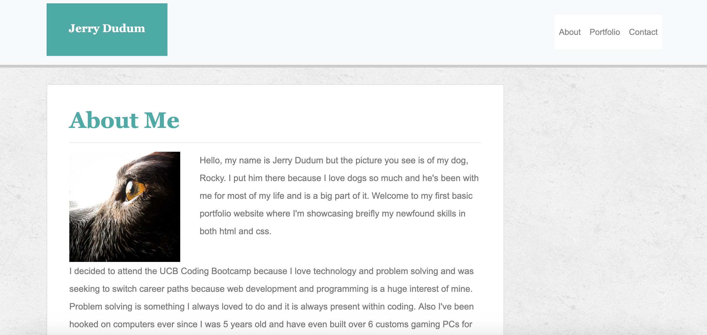
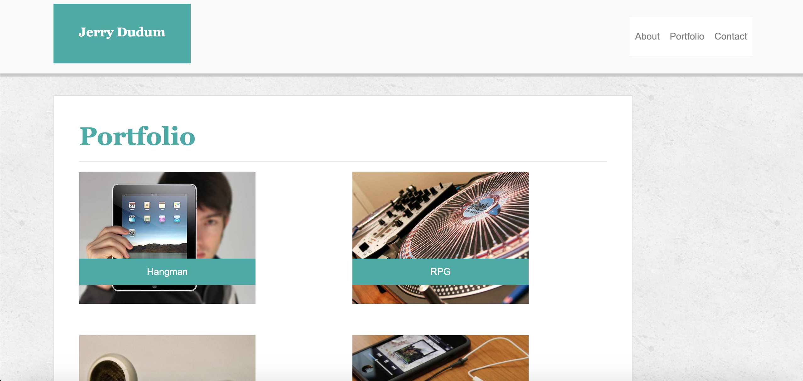
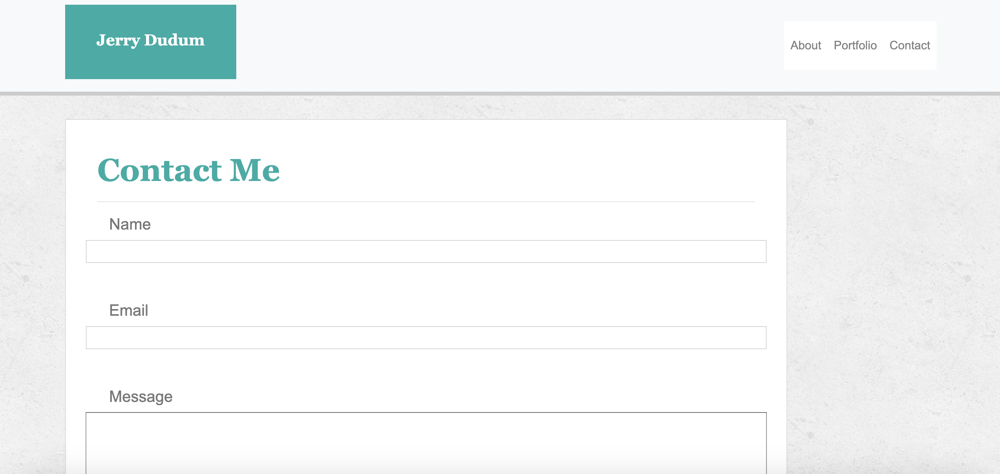
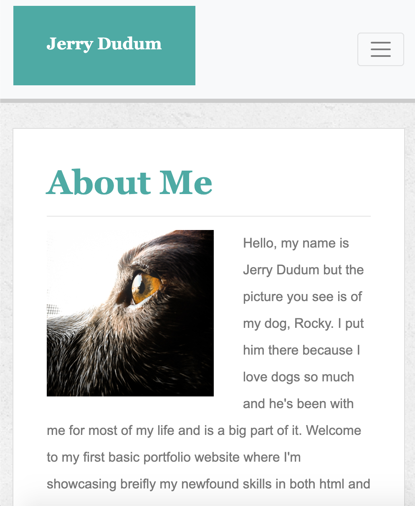
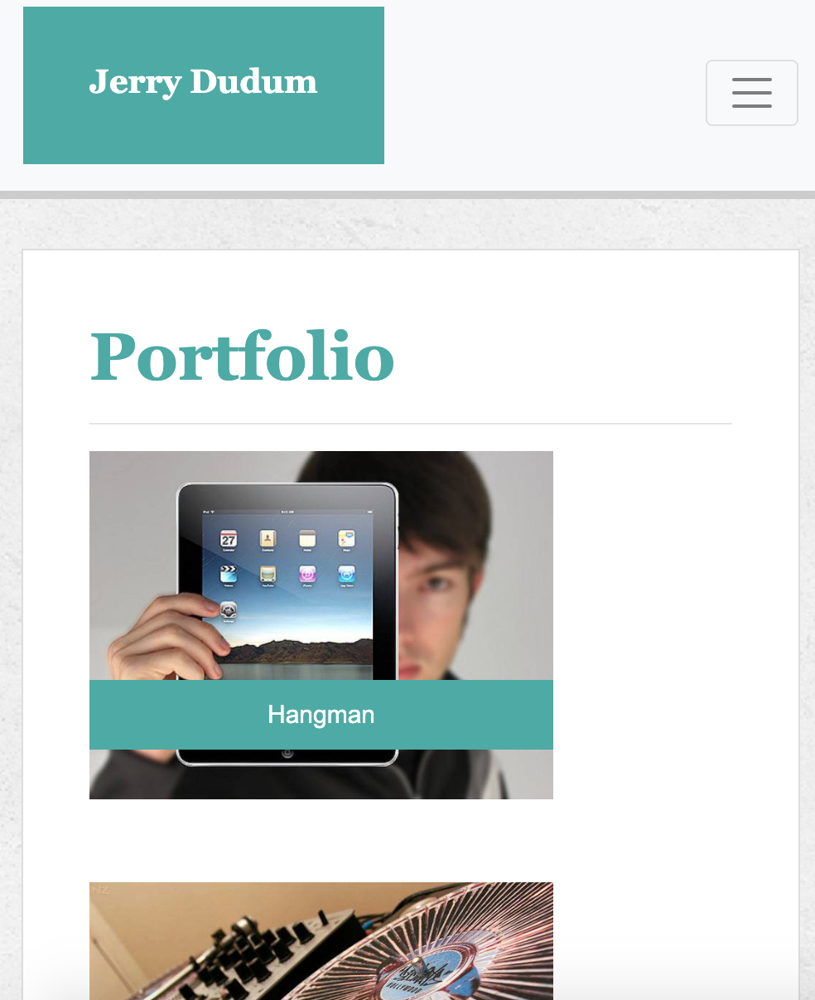
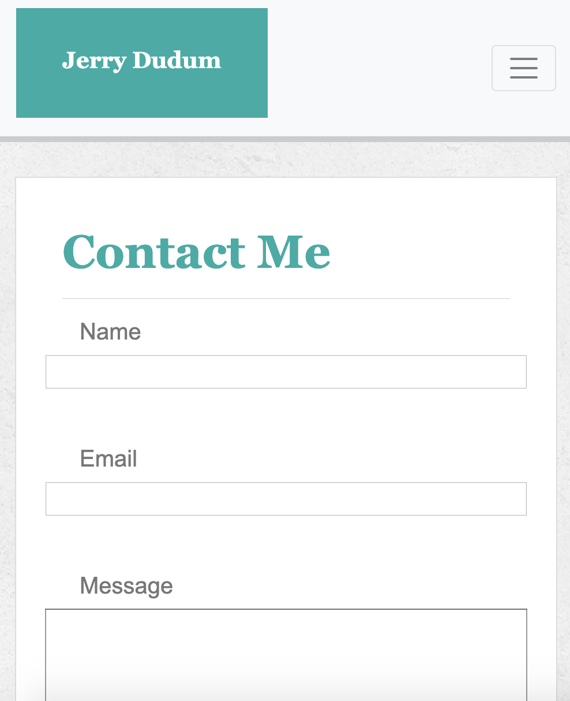

# Bootstrap-Portfolio

## Site Pictures

## Technologies Used
- HTML 
- CSS
- Git
- GitHub

## Summary

This application is my first portfolio page with bootstrap added to it to make it more responsive.

### Links
- [Bootstrap-Portfolio](https://jerry-dudum.github.io/Bootstrap-Portfolio/)
- [LinkedIn](https://www.linkedin.com/in/jsdudum/)